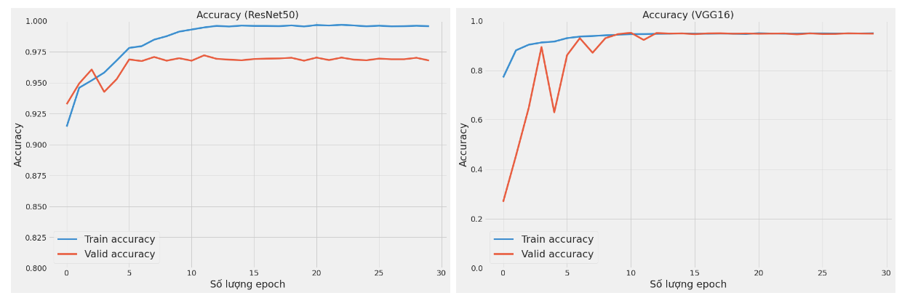
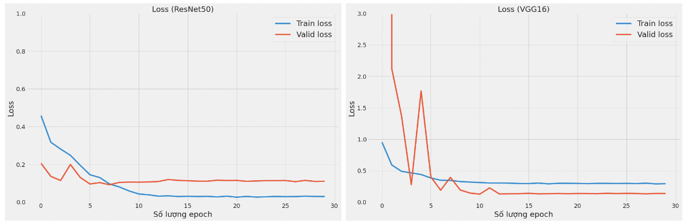

<div align='center'>

# Detect COVID-19 and Pneumonia via Chest X-Ray images using Deep Learning approaches

</div>

In this work, we propose a rapidly testing method which has a high productivity in a short time. In details, we will apply deep learning neural networks, e.g. ResNet50 and VGG16 to solve this problem. After that, we will proceed analysing pros and cons of those models for a thorough vision about applying artificial intelligence in COVID-19 rapid testing.
### Contents
1. [Introduction](#1-introduction)
2. [Prerequisites ](#2-prerequisites)
3. [Install and set up environment](#3-install-and-set-up-environment)
4. [Dataset demonstration](#4-dataset-demonstration)
5. [Metrics](#5-metrics)
6. [Experimental configuration](#6-experimental-configuration)
7. [Results](#7-results) 
8. [Demo](#8-demo)


---

### 1. Introduction
This work is conducted by:
- [Tan Ngoc Pham](https://github.com/ngctnnnn/)
- [An Vo](https://github.com/vokhanhan25)
- [Dang Vu](https://github.com/twelcone/)
#### Dataset's description
In this research, we use [COVIDx dataset](https://github.com/lindawangg/COVID-Net) [2] - which is a widely used dataset in recent research about COVID-19 nowadays. COVIDx Datset is a dataset synthesized from many a different source, which are in details: Cohen et al. [3], Chung [4], Chung [5], Radiological Society of North America [5],and Radiological Society of North America [6]. Additionally, this dataset also provides an image extension transfer tool: from `.mri` into `.jpg`. And the author moreover provide a code to support data pre-processing and getting rid of unnecessary part for synthesized data.
#### Method
We proposed using *diagnostic imaging*, which is an approach using Chest X-ray (CXR) image. This is due to its lower cost and faster testing time in comparison with Real-time Polymerase Chain Reaction (RT PCR) or Computed Tomography (CT) Image.

#### Model approach
Throughout this research, we use 2 different approaches which are **ResNet50** and **VGG16** to solve this problem. VGG16 is a deep neural network architecture under-using residual design principals, it is also a compact architecture which has a low diversity of architectures. On the other hand, ResNet50 is a deep neural network harnessing residual design principles and it has a moderate diversity of architectures. This network brings many a high productivity in a large number of researching in classifying X-ray images. Despite each approach has its own benefits and drawbacks, both are proved their productivity through real application.

### 2. Prerequisites 
- Python >=  3.6
- Sklearn >= 0.24.2
- NumPy >= 1.13.3
- Tensorflow >= 2.6

### 3. Install and set up environment
```bash
conda create -n covid-detect python==3.8 -y
conda activate covid-detect 
pip3 install -r requirements.txt
jupyter notebook
```

### 4. Dataset demonstration
We would use COVIDx dataset version 5 [1] with about 30,000 CXR images. The dataset's author also supply some tools to support the preprocessing process, e.g., transforming medical images from the original format into the more popular ones `.jpg`, synthesizing and removing duplicated components in the datasets. Additionally, we also split the dataset into three separate sets including train set, validation set, and test set with the distribution appeared in Table 1.


<div align='center'>


| | Train | Validation | Test | Sum |
|:--:|:--:|:--:|:--:|:--:|
| COVID-19 | 13,192 | 3298 | 200 | 16690 | 
|  Normal | 6468 | 1617 | 100 | 8185 | 
| Pneumonia | 4444 | 1111 | 100 | 5655 | 
| Sum | 24104 | 6026 | 400 | 30530 | 


<b> Table 1. </b> Dataset's distribution

</div>

### 5. Metrics
#### Precision


#### Recall

#### F1-score

### 6. Experimental configuration

We use the hyperparameters settings to do the training for two models demonstrated as follows:
- learning rate:  1e-3
- Optimization algorithm: Adam [14]
- Number of epochs: 30
- Batch size: 32
- Factor: 0.1
- Learning rate's patience: 1
- Input resolution: 480x480
       

The training process is conducted on Colab Pro Plus with NVidia P100 GPU, 32GB RAM, 4 vCPU CPU.     

### 7. Results 
<div align='center'>


Confusion matrix of ResNet50 (left) and VGG16 (right).
</div>

<div align='center'>

| | Precision | Recall | F-score | Image numbers | 
|:--:|:--:|:--:|:--:|:--:|
| COVID-19 | 0.99 | 1.00 | 1.00 | 200 | 
| Normal | 0.89 | 0.98 | 0.93 | 100 |
| Pneumonia | 0.99 | 0.87 | 0.93 | 100 | 


<b>Table 2.</b>Classification report of VGG16.

</div>

<div align='center'>

| | Precision | Recall | F-score | Image numbers | 
|:--:|:--:|:--:|:--:|:--:|
| COVID-19 | 1.00 | 1.00 | 1.00 | 200 | 
| Normal | 0.94 | 0.98 | 0.96 | 100 |
| Pneumonia | 0.99 | 0.94 | 0.96 | 100 |


<b>Table 3.</b> Classification report of ResNet50.

</div>


<div align='center'>



<b>Figure 5. </b> Accuracy of ResNet50 (left) and VGG16 (right).

</div>


<div align='center'>

| | Accuracy | Number of parameters | Training time (hour) | 
|:--:|:--:|:--:|:--:|
| VGG16 | 96.24% | 14,781,251 | 17,1 | 
| ResNet50 | 98.00% | 23,827,971 | 15.45 | 
| VGG19 (Wang et al. [1]) | 83% | 20,370,000 | - | 
| ResNet50 (Wang et al. [1]) | 90.6% | 24,970,000 | - | 
| COVID-Net (Wang et al. [1]) |  93.3% | 11,750,000 | - | 

</div>

<div align='center'>

<b>Table 4.</b> Accuracy, number of parameters, and training time of VGG16 and ResNet50.

</div>

<div align='center'>



<b>Figure 6. </b> Loss of ResNet50 (left) and VGG16 (right).

</div>

### 8. Demo

<div align='center'>


<a href="https://user-images.githubusercontent.com/67086934/192569822-4a3a44f1-883e-4979-ae1d-8cf3cec830e2.mp4">Demo web</a>


       
       
</div>

<div align='center'>


<a href="https://user-images.githubusercontent.com/67086934/192569841-64cb422d-65ff-4961-abf6-c4dec7bbaefb.mp4">Demo mobile</a>


</div>
